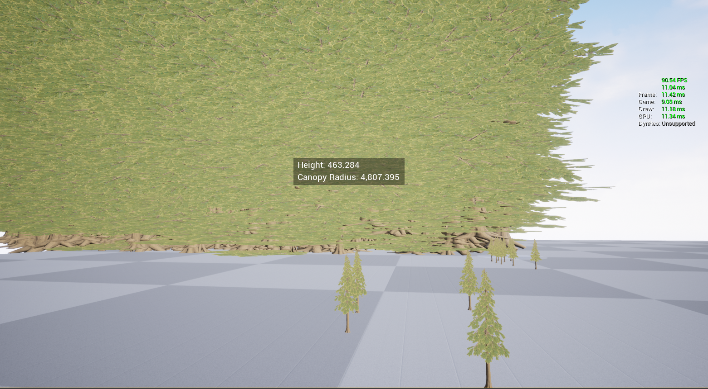

# Tree Spawner Project

This is a small application for spawning large numbers of trees at randomly generated locations and dimensions.

[Demo video can be viewed here.](https://youtu.be/_Iyv76pFPLo)

## Instructions

**WASD** to move around, **Q** and **E** to change elevation.

**Mouse wheel down** to increase movement speed, **mouse wheel up** to decrease movement speed.

**Left click** to display height and canopy radius info.

**Middle click** or **F** to place new trees.

By default, the spawner will load 10,000 trees on begin play. This value can be tweaked to any value in `BP_TreeSpawner`. The screenshot below demonstrates 200,000 trees with FPS ranging from 30-100 on an RTX 2080 and Ryzen 3600.

## Notes

I used a Hierarchial Static Mesh Component (HISM) to store the tree instances.

As the number of trees grew large (100,000+) I made some tweaks to improve performance. I disabled shadows, lowered the LOD of the tree's static mesh, and enabled distance culling (as can be seen in the video).

Adding a new tree with a very large number of trees in the level (e.g. 200,000) caused a lag spike. I believe this was due to adding another leaf to the HISM "cluster tree" structure.

The project hanged when building with the 100,000 tree header file included, so I rewrote the generator in `TreeGenerator.cpp`
